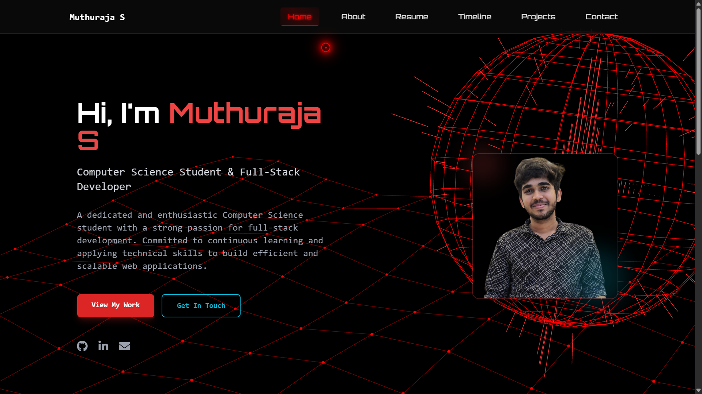

# Cyberpunk Portfolio Website

A modern, responsive portfolio website featuring a cyberpunk aesthetic with red and black color scheme, 3D backgrounds, and smooth animations.



## Features

### Visual Design
- **Cyberpunk Theme**: Sleek red and black color scheme with neon glow effects
- **3D Background**: Interactive Vanta.js Globe on desktop (disabled on mobile for performance)
- **Custom Cursor**: Animated cursor with hover effects on resume and timeline pages
- **Responsive Design**: Optimized for desktop, tablet, and mobile devices
- **Typography**: Premium fonts including Orbitron and Rajdhani

### Animations
- **H1 Typewriter Effect**: Simple, lightweight typing animation on all pages
- **Smooth Transitions**: Hover effects and page transitions
- **Performance Optimized**: Respects user's reduced motion preferences

### Mobile Optimization
- **Plain Black Background**: 3D effects disabled on mobile for better performance
- **Touch-Friendly**: Optimized navigation and button sizes
- **Fast Loading**: Minimal JavaScript for mobile users

### 🛠Technical Features
- **Clean Codebase**: Removed all unused animations and bloated code
- **Semantic HTML**: Proper structure and accessibility
- **Modern CSS**: CSS Grid, Flexbox, and custom properties
- **Vanilla JavaScript**: No heavy frameworks, pure performance
- **Cross-Browser**: Support for all modern browsers

## Project Structure

```
project/
├── index.html                 # Homepage with 3D background
├── about/
│   └── index.html            # About page
├── projects/
│   └── index.html            # Projects showcase
├── timeline/
│   └── index.html            # Career timeline with custom cursor
├── resume/
│   └── index.html            # Resume page with custom cursor
├── contact/
│   └── index.html            # Contact form
├── public/
│   ├── css/
│   │   └── main.css          # Main stylesheet (optimized)
│   ├── js/
│   │   ├── main.js           # Core functionality
│   │   ├── simple-animations.js  # H1 typewriter effect
│   │   └── contact.js        # Contact form handling
│   └── img/
│       ├── Profile.jpg       # Profile image
│       └── P.png            # Logo
├── _config.yml              # Jekyll configuration
├── netlify.toml             # Netlify deployment config
└── package.json             # Dependencies
```

## � Getting Started

### Prerequisites
- Web browser with JavaScript enabled
- Local server for development (optional)

### Installation

1. **Clone the repository**
   ```bash
   git clone https://github.com/Black-and-Yellow/Portfolio_Website.git
   cd Portfolio_Website/project
   ```

2. **Run locally** (optional)
   ```bash
   # Python 3
   python -m http.server 8000
   
   # Node.js
   npx serve .
   
   # PHP
   php -S localhost:8000
   ```

3. **Open in browser**
   ```
   http://localhost:8000
   ```

## Pages Overview

### Homepage (`index.html`)
- **3D Globe Background**: Interactive Vanta.js animation (desktop only)
- **Hero Section**: Introduction with typewriter effect
- **Responsive Navigation**: Desktop and mobile-friendly menu

### About (`about/index.html`)
- **Personal Information**: Bio and background
- **Skills Section**: Technical skills and expertise
- **Clean Layout**: Focused on content

### Projects (`projects/index.html`)
- **Portfolio Showcase**: Featured projects and work
- **Project Cards**: Interactive project previews
- **External Links**: GitHub and live demo links

### Timeline (`timeline/index.html`)
- **Career Journey**: Professional timeline
- **Custom Cursor**: Enhanced interaction with cyberpunk cursor
- **Milestone Highlights**: Key career achievements

### Resume (`resume/index.html`)
- **Professional Resume**: Downloadable PDF version
- **Custom Cursor**: Enhanced interaction effects
- **Skills Matrix**: Technical and soft skills

### Contact (`contact/index.html`)
- **Contact Form**: Functional contact form
- **Social Links**: Professional social media
- **Location Info**: Contact details

## Customization

### Colors
The cyberpunk theme uses CSS custom properties defined in `main.css`:

```css
:root {
  --cyber-black: #000000;
  --cyber-red: #ff0000;
  --cyber-text: #e0e0e0;
  --cyber-gray: #333333;
  /* ... */
}
```

### Fonts
- **Orbitron**: Used for headings and navigation
- **Rajdhani**: Used for body text
- **Inter**: Used for clean content sections

### 3D Background Configuration
Modify the Vanta.js settings in `index.html`:

```javascript
VANTA.GLOBE({
    color: 0xff0000,           // Primary color
    backgroundColor: 0x000000,  // Background
    size: 1.20,                // Globe size
    speed: 1.0,                // Animation speed
    // ... more options
});
```

## 📱 Mobile Considerations

### Performance Optimizations
- **No 3D Effects**: Vanta.js disabled on mobile devices
- **Simplified Animations**: Reduced motion for better performance
- **Touch Navigation**: Mobile-optimized menu and interactions

### Responsive Breakpoints
- **Mobile**: < 768px
- **Tablet**: 768px - 1024px
- **Desktop**: > 1024px

## �️ Development

### Recent Optimizations
- Removed 5 unused JavaScript animation files
- Cleaned up CSS from 800+ to 616 lines (23% reduction)
- Fixed cursor animations on resume and timeline pages
- Optimized navbar styling with proper fonts
- Disabled 3D background on mobile for performance

### Dependencies
- **Vanta.js**: 3D background effects (desktop only)
- **Three.js**: 3D rendering library
- **Font Awesome**: Icons
- **Google Fonts**: Orbitron, Rajdhani, Inter


### GitHub Pages
Compatible with GitHub Pages for static hosting.

### Custom Server
Can be hosted on any web server that supports static files.

## Configuration Files

- **`_config.yml`**: Jekyll configuration for GitHub Pages
- **`package.json`**: Project dependencies and metadata


## � Author

**Your Name**
- GitHub: [@Black-and-Yellow](https://github.com/Black-and-Yellow)
- Portfolio: [Portfolio Website](https://muthuraja.tech/)

## Acknowledgments

- **Vanta.js** for amazing 3D background effects
- **Three.js** for 3D rendering capabilities
- **Font Awesome** for beautiful icons
- **Google Fonts** for premium typography

---

**Star this repository if you found it helpful!**

**Have questions?** Open an issue or reach out via the contact form.
